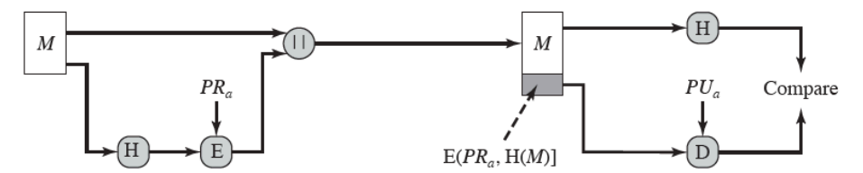

# PARTE 2 | Assinatura
### PARTE 2 | Funções de Hash

Uma função de hash recebe uma mensagem de tamanho variável como entrada e gera um valor de hash de tamanho fixo, H(M). O principal objetivo dessa função é garantir a integridade dos dados, ou seja, verificar se a mensagem não foi alterada, além de assegurar segurança e autenticidade.

Para que uma função de hash seja confiável, ela deve possuir as seguintes propriedades:

- **Propriedade de mão única:** Não é possível descobrir a entrada a partir do hash.
- **Determinística:** A mesma entrada sempre gera o mesmo hash.
- **Eficiência:** O cálculo do hash deve ser rápido.
- **Resistência à colisão:** Entradas diferentes não devem gerar o mesmo hash.
- **Efeito avalanche:** Pequenas alterações na entrada resultam em mudanças drásticas no hash.

No algoritmo RSA, a função de hash desempenha um papel fundamental no processo de assinatura digital:



Conforme ilustrado na imagem acima, é necessária uma função para gerar o hash da mensagem em texto claro antes de assiná-la. Dessa forma, a função de hash será criada para que possa ser utilizada posteriormente na função de assinatura.

> A biblioteca `hashlib` no Python cria marcas únicas (chamadas de hashes) a partir de dados, como textos ou arquivos. Ela aplica algoritmos matemáticos (como SHA-256 ou MD5) para gerar uma sequência única de caracteres que representa os dados de entrada.
>
> 
> **Observação:** Esta biblioteca assegura as cinco propriedades necessárias para um hash seguro citadas acima.

Nesse projeto, para a assinatura, é utilizada a família SHA-3, que emprega a **construção esponja**. Esse método funciona de maneira semelhante a uma esponja: primeiro, ele "absorve" os dados e, depois, os "extrai". Segue abaixo a implementação do código:

```python
# Função para gerar o hash de uma mensagem
def gerar_hash(self, mensagem):
    # Verifica se a mensagem é um arquivo de texto
    if isinstance(mensagem, str) and mensagem.endswith('.txt'):  
        # Abre o arquivo em modo binário ('rb') e lê todo o conteúdo
        with open(mensagem, 'rb') as f:
            mensagem = f.read()  # Armazena o conteúdo completo do arquivo
    elif isinstance(mensagem, str):  # Verifica se a mensagem é uma string
        mensagem = mensagem.encode(encoding="utf-8")  # Converte a string para bytes usando a codificação UTF-8

    # Cria um objeto de hash utilizando o algoritmo SHA3-256
    gh = hashlib.sha3_256()  
    # Atualiza o objeto de hash com o conteúdo da mensagem
    gh.update(mensagem)  
    # Retorna o hash gerado em formato binário (bytes)
    return gh.digest()
```


### PARTE 2 | Assinatura

A assinatura digital RSA é um método criptográfico que utiliza o algoritmo RSA para garantir a autenticidade e integridade de uma mensagem ou documento. Nesse processo, o remetente utiliza sua chave privada para gerar uma assinatura única baseada no conteúdo da mensagem. O destinatário, por sua vez, pode verificar essa assinatura utilizando a chave pública correspondente, assegurando que a mensagem não foi alterada e que realmente provém do remetente alegado.

Como representado na figura a seguir:


### Etapas da implementação

**Função assinatura**

- A função `assinar_msg` vai receber como entrada a mensagem em claro e gerar o hash dessa mensagem usando a função feita acima `gerar_hash`, H(M).

```python
def assinar_msg(self, mensagem):
    # Gera o hash da mensagem utilizando a função gerar_hash
    hash_mensagem = self.gerar_hash(mensagem) # H(M), retorna o hash em bytes
```

- Nessa etapa da assinatura é usado o algoritmo RSA para assinar o hash da mensagem usando a chave privada: S = H(M)^d mod N. O código chama o método de criptografia da classe `RSA` para realizar a cifração do hash da mensagem, armazenando a assinatura na variável `assinatura_mensagem`.

```python
 # Criptografa o hash da mensagem utilizando a chave privada do RSA
    assinatura_msg = self.rsa.RSACriptografa(hash_mensagem)  # Recebe e retorna a assinatura em bytes
```

- A última etapa é formatar a assinatura para o formato base64. A assinatura está em bytes então basta recebê-la como entrada usando a biblioteca `base64`:

```python
 # Codifica a assinatura em Base64 para facilitar o armazenamento e transmissão
    assinatura_msg_base64 = base64.b64encode(assinatura_msg)
    
    # Retorna a assinatura codificada em Base64 e a mensagem original
    return assinatura_msg_base64, mensagem
```

No final, retorna a assinatura em formato base64 + a mensagem em claro para o destino.

> `base64` é uma biblioteca que converte dados binários em uma representação de texto legível, utilizando um conjunto de 64 caracteres.

### PARTE 3 | Verificação

Para a verificação da assinatura, o destinatário utiliza a chave pública do remetente para validar a assinatura gerada. Isso envolve o uso do algoritmo de hash para recalcular o valor da mensagem e comparar com o valor da assinatura recebida. Se os valores coincidirem, a assinatura é considerada válida, confirmando que a mensagem não foi alterada e que a assinatura realmente pertence ao remetente.

### **Etapas da implementação**

**Função de verificação**

- A função de verificação recebe como entrada a assinatura da mensagem (em formato base64) e a mensagem em claro. Primeiro, ela gera o hash da mensagem em claro e guarda na variável `hash_msg` em formato bytes, H(M).

```python
def verificar_ass(self, assinatura_base64, mensagem):
    # Gera o hash da mensagem em texto claro utilizando a função gerar_hash 
    hash_msg = self.gerar_hash(mensagem) # Retorna o hash em bytes
```

- Depois de armazenar o hash da mensagem original, é preciso extrair o hash da assinatura. Para isso, é usado o método da classe `RSA` para decifrar a assinatura, mas agora, usando a chave pública: S = H(M)^e mod n. Para usar o método, precisamos dos dados em formato binário, então, antes, o código converte base64 > bytes.

```python
    # Decodifica a assinatura de Base64 para bytes
    assinaturaEmBytes = base64.b64decode(assinatura_base64)
    
    # Descriptografa a assinatura utilizando a chave pública do RSA para recuperar o hash original
    hash_recuperado = self.rsa.RSADescriptografa(assinaturaEmBytes)  # Retorna o hash recuperado em formato de bytes
```

- Na última etapa da verificação, comparamos o hash da mensagem em claro `hash_msg` com o hash recuperado a partir da assinatura `hash_recuperado`:
  ```python
    # Compara o hash da mensagem recebida com o hash recuperado da assinatura
    if hash_msg == hash_recuperado:
        print('Assinatura válida!')  # Se os hashes forem iguais, a assinatura é válida
    else:
        print("Assinatura inválida!")  # Se os hashes forem diferentes, a assinatura é inválida
